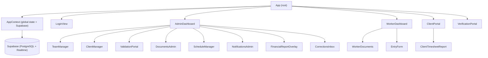

<!-- generated-by: gsd-doc-writer -->
# Architecture

## System Overview

Magnetic Place is a React single-page application for workforce management at a staffing/consultancy company. It allows administrators to manage workers, clients, time logs, expenses, schedules, and documents; workers to register their own time entries and access their documents; and clients to access a read-only validation portal where they review and approve timesheet reports. The application follows a role-based view model — a single React root renders different dashboards depending on the authenticated user's role (`admin`, `worker`, or `client_portal`). All persistent state is stored in Supabase (PostgreSQL) and kept in sync via Supabase Realtime subscriptions. Document generation (DOCX, PDF) happens entirely in the browser using client-side libraries.

## Component Diagram



## Data Flow

A typical user session follows this path:

1. **Bootstrap** — `AppContext` initialises a Supabase JS client using `VITE_SUPABASE_URL` and `VITE_SUPABASE_ANON_KEY`. All tables (`clients`, `workers`, `logs`, `expenses`, `approvals`, `documents`, `corrections`, `correction_items`, `app_notifications`, etc.) are fetched in parallel with `Promise.all`.
2. **Realtime** — After the initial fetch, Supabase Realtime channels are opened for `app_notifications`, `corrections`, `correction_items`, and `logs`. Incoming `INSERT`/`UPDATE`/`DELETE` events patch the corresponding React state slices so the UI stays live without polling.
3. **Authentication** — `LoginView` validates credentials against the `workers` table (admin password is stored in `system_settings`). On success, `handleLogin` in `App` sets `currentUser` and `view` in React state and persists them to `localStorage`.
4. **View routing** — `App` uses the `view` string (`login` | `admin` | `worker` | `client_portal`) and URL query params (`?view=verify&id=…`, `?view=client_portal&client=…&month=…`) to conditionally render the matching dashboard. No client-side router library is used; routing is manual conditional rendering.
5. **Writes** — Components call `saveToDb(table, id, data)` from `AppContext`, which performs an upsert to Supabase. Local state is updated optimistically alongside the database call.
6. **Document generation** — When a worker or admin generates a document, `docxTemplateService.js` or `timesheetTemplateService.js` fills a DOCX template in-memory (using `docxtemplater` + `pizzip`), then converts or exports it to PDF via `pdf-lib` or `jsPDF`. QR codes are generated with `qrcode` and embedded in reports. Signatures are captured via `react-signature-canvas` and stored as base64 data URLs.
7. **Email dispatch** — Outbound emails (client portal links, correction notifications) are sent from the browser via the EmailJS SDK using `VITE_EMAILJS_SERVICE_ID`, `VITE_EMAILJS_TEMPLATE_ID_*`, and `VITE_EMAILJS_PUBLIC_KEY`.

## Key Abstractions

| Abstraction | File | Description |
|---|---|---|
| `AppContext` / `useApp` | `src/context/AppContext.jsx` | Global React context providing all data states, the Supabase client, `saveToDb`, and `handleDelete` to the entire tree |
| `AppProvider` | `src/context/AppContext.jsx` | Wraps the application tree; owns Supabase initialisation, bulk data fetch, and Realtime subscriptions |
| `AdminDashboard` | `src/features/admin/AdminDashboard.jsx` | Top-level admin view; orchestrates tab navigation across all admin sub-features |
| `WorkerDashboard` | `src/features/worker/WorkerDashboard.jsx` | Top-level worker view; integrates time entry, schedule, and document access |
| `ClientPortal` | `src/ClientPortal.jsx` | Public-facing timesheet review and approval portal accessed via unique URL |
| `VerificationPortal` | `src/components/common/VerificationPortal.jsx` | Public signature verification page rendered when `?view=verify&id=…` is present |
| `saveToDb` | `src/context/AppContext.jsx` | Unified upsert helper used across all features to write to Supabase |
| `docxTemplateService` | `src/utils/docxTemplateService.js` | Fills DOCX templates with worker/client data; handles image and QR embedding |
| `timesheetTemplateService` | `src/utils/timesheetTemplateService.js` | Generates timesheet DOCX reports from time log data |
| `correctionsApi` | `src/utils/correctionsApi.js` | Encapsulates read/write operations for the corrections v2 data model |

## Directory Structure Rationale

```
src/
├── app.jsx                  # Root component: view routing, global modals, email dispatch
├── ClientPortal.jsx         # Self-contained client-facing portal (separate from admin/worker flows)
├── context/
│   └── AppContext.jsx       # Single global context; all Supabase I/O centralised here
├── features/
│   ├── admin/               # Admin-only views and business logic (dashboard, validation, documents, scheduling)
│   │   └── corrections/     # Corrections inbox and admin correction handling
│   ├── worker/              # Worker-only views (dashboard, time entry)
│   │   └── contexts/        # Worker-scoped React context (WorkerContext)
│   ├── auth/                # Login view
│   └── client-report/       # Client-facing report rendering (used inside ClientPortal)
├── components/
│   ├── admin/               # Reusable admin UI components (document viewer, signature modal, templates admin)
│   ├── worker/              # Reusable worker UI components
│   └── common/              # Shared components used across roles (EntryForm, stamps, timesheet report, verification portal)
├── utils/                   # Pure utility modules: date, format, email, PDF, DOCX, AI, signatures
├── hooks/                   # Custom React hooks
├── constants/               # Shared constant values
├── assets/                  # Static assets (images, fonts)
└── mocks/                   # MSW mock handlers for development/testing
```

The `features/` split enforces role boundaries at the code level: admin code never imports from `features/worker` and vice versa. Shared UI primitives live in `components/common/`. All external service communication (Supabase, EmailJS, Google Generative AI, PDF.co) is isolated in `utils/` modules, keeping components free of direct API calls.
